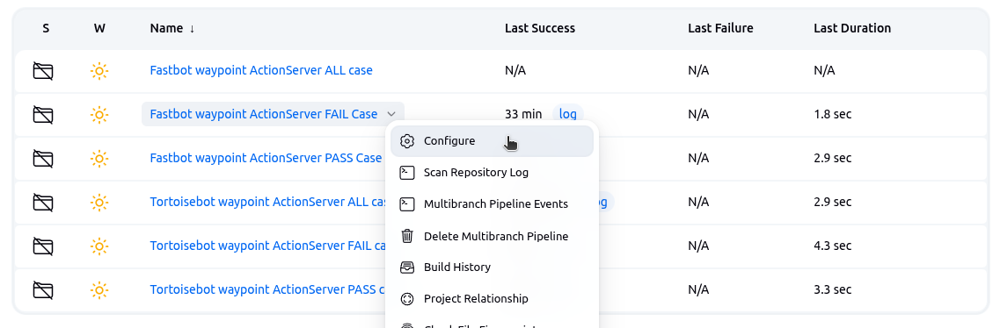
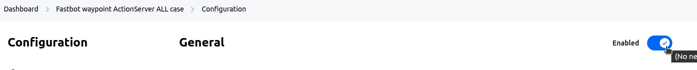
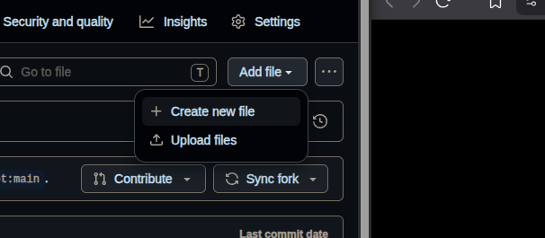
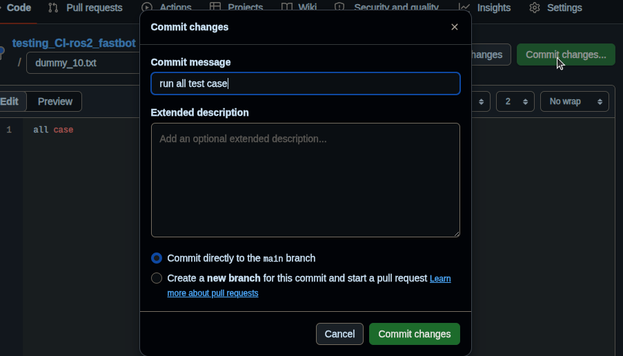
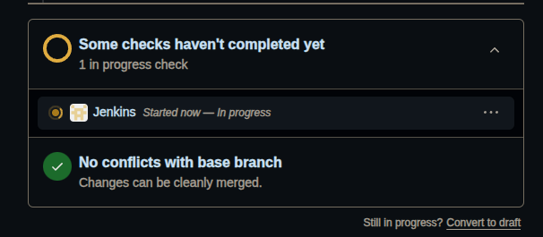
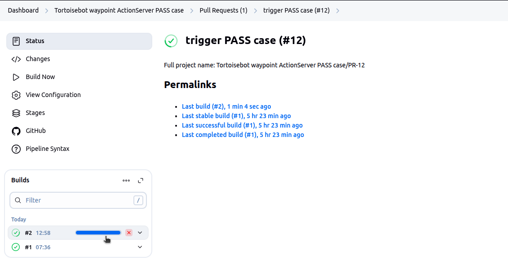
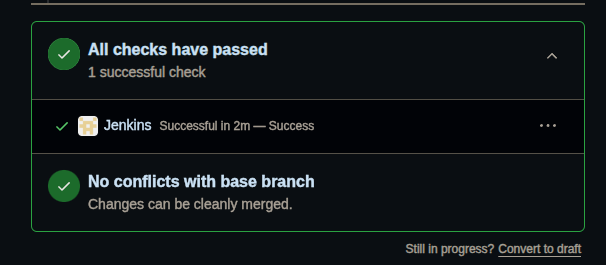

# ROS2 CI — Checkpoint 24 Task 2

## Overview
Jenkins CI pipeline that triggers on GitHub Pull Requests, builds a Docker image with ROS 2 Humble + FastBot + waypoints action server, runs Gazebo simulation + waypoints tests inside the container, and reports results back to GitHub.

---

## Repository Structure

| File | Purpose |
|---|---|
| `Dockerfile` | ROS 2 Humble + Gazebo 11 + FastBot + waypoints image |
| `Jenkinsfile` | Pipeline: build image → launch Gazebo → run waypoints tests |
| `aliases.sh` | Convenience shell aliases for the Construct machine |
| `jenkins-infra/scripts/jenkins_bootstrap.sh` | Installs + starts Jenkins each session |
| `jenkins-infra/scripts/install_plugins.sh` | Installs Jenkins plugins (run once) |
| `jenkins-infra/jenkins/plugins.txt` | Pinned plugin list for Jenkins 2.504.3 |

---

## Build image

```bash
cd ~/ros2_ws/src/ros2_ci
docker build -t fastbot-humble-gazebo:latest .
```

## Run container (manual test)

```bash
docker run --rm \
  -e DISPLAY=${DISPLAY} \
  -v /tmp/.X11-unix:/tmp/.X11-unix:rw \
  fastbot-humble-gazebo:latest bash -lc \
  'ros2 launch fastbot_gazebo one_fastbot_room.launch.py'
```

---

## Instructions (For Evaluation)

### Start jenkins server

> [ ⚠️ Warning ]
Consider the images below as just reference. Pipeline names (Tortoisebot / Fastbot) will be interchanged in the images 

```bash
cd ~/ros2_ws/src/ros2_ci

# Install / start jenkins server
bash jenkins-infra/scripts/jenkins_bootstrap.sh

# Install Jenkins Plugins
bash jenkins-infra/scripts/install_plugins.sh
```
> [Note]
Installations are persistent on the cloud for every session, so just starting the server might be sufficient.


### Switching Between Pass and Fail Test Cases Pipelines

Once logged into Jenkins with `admin` (_password: **admin**_) privilege, on the dashboard you can see 3 different pipelines all being disabled.

| Pipeline Name | Purpose |
|---|---|
| `Fastbot Waypoint ActionServer FAIL case` | Runs only Fail test case |
| `Fastbot Waypoint ActionServer PASS case` | Runs only Pass test case |
| `Fastbot Waypoint ActionServer ALL case` | Runs both Pass & Fail test case in 2 `stages` |


`Enable` one of the pipelines having `PASS` / `FAIL` / `ALL` case for FastBot through the config




Click Apply & Save, then check if the pipeline has picked up the changes from the repo


### Raise a `Pull Request`
Fork this repo's `main` and add a dummy text file under the `dummies` folder inside the repo



Commit the changes and initiate a PR




### Watch for Build being Triggered
Once the PR gets accepted, you can see the pipeline getting triggered



also watch the jenkins build & console

> [Note] If the build doesn't appear on the list of builds or build history, `Refresh` the page to see if a new build appears under `pipeline > status` / `pipeline > Pull Request (tab)`


Look out for new builds (Note: Refresh the page if it doesn't appear)




In the `console output`, when the container starts, switch to TheConstruct page to see Gazebo starting and FastBot moving towards the goal.

In your GitHub PR page you should see the same



## Closing Note

once pipeline gets completed, `Disable` the pipeline

